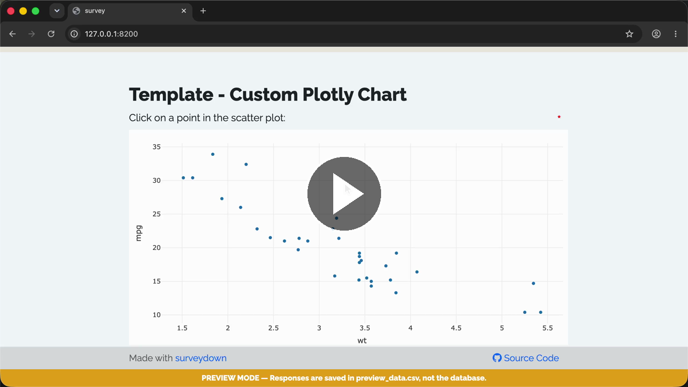

# Template - Custom Plotly Chart

A template of a custom plotly chart question using `sd_question_custom()`.

### See it in action

Play with the [**Live demo**](https://surveydown-custom-plotly-chart.share.connect.posit.cloud) or watch the **Walkthrough recording:**

[](https://cdn.jsdelivr.net/gh/surveydown-dev/template_custom_plotly_chart@main/video-recording.mp4)

### Create this template

Run this command in your R console:

```r
surveydown::sd_create_survey(
  #path = "path/to/survey",
  template = "custom_plotly_chart"
)
```

### Learn more

- [Template page - Custom Plotly Chart](https://surveydown.org/templates/custom_plotly_chart)
- [Document page - Custom questions: plotly chart](https://surveydown.org/docs/custom-questions#plotly-chart-example)
- [Document page - Start with a template](https://surveydown.org/docs/getting-started#start-with-a-template)
